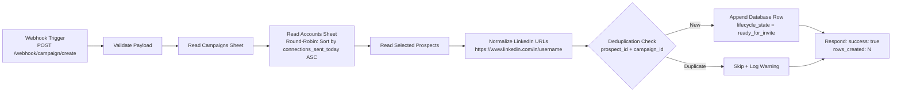
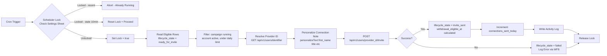
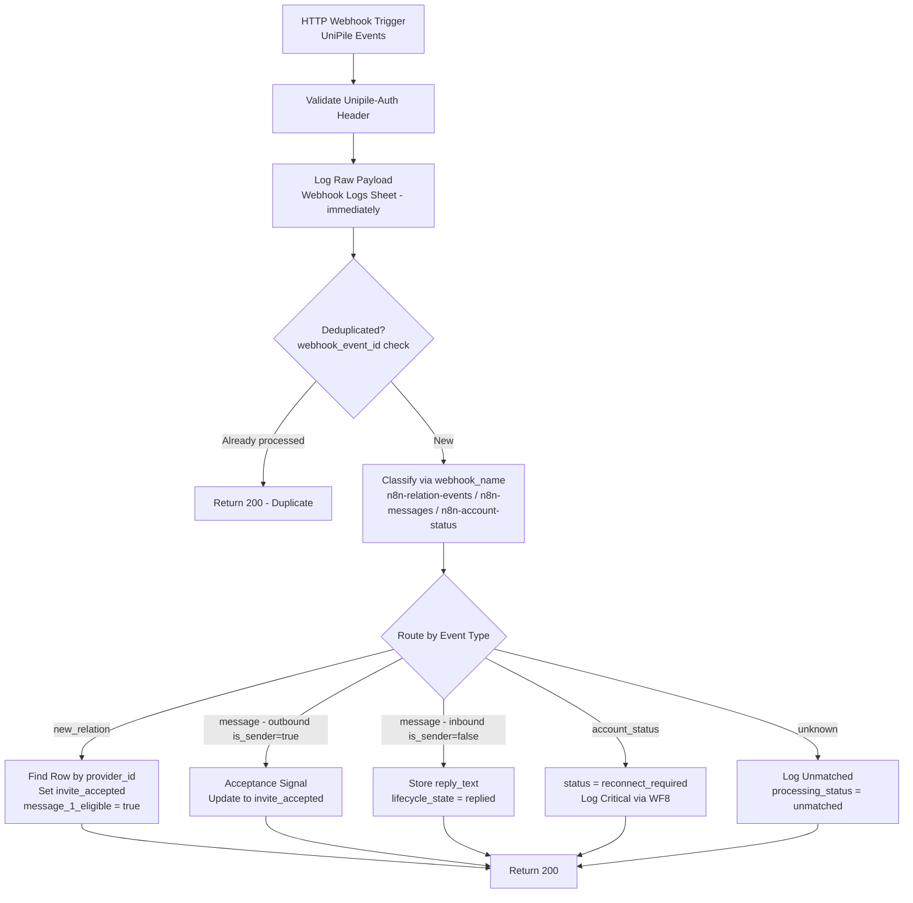
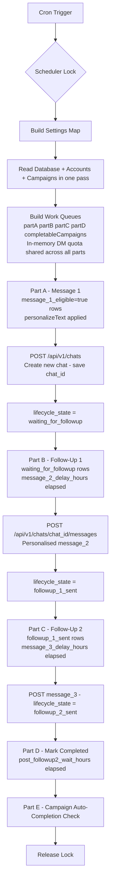
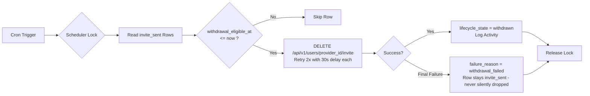
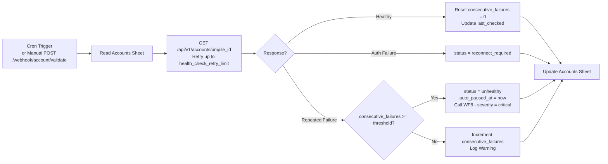
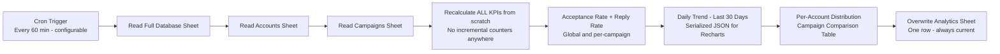
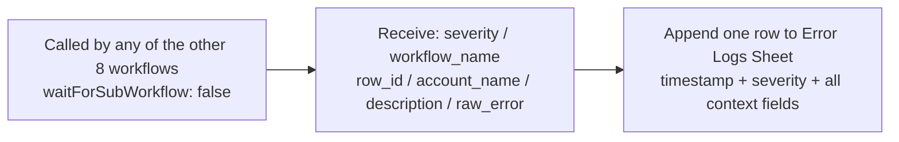
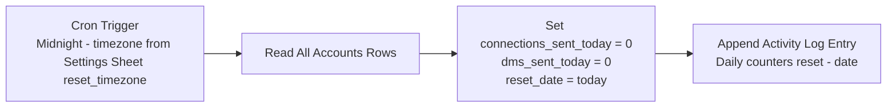

<div align="center">

[](https://www.youtube.com/watch?v=WcmIBq5dHro)
</a>
<br/><br/>

# LinkedIn Outreach OS

### A production-grade LinkedIn outreach automation platform built like Apollo, Instantly, or Lemlist - powered by n8n, UniPile, Google Sheets, and React.

<br/>

[](.)
[](https://n8n.io)
[](https://unipile.com)
[](https://sheets.google.com)
[](https://react.dev)
[](https://www.typescriptlang.org)
[](https://pages.cloudflare.com)

</div>

---

## The Story Behind This Project

The client came with a process, not a problem. They already knew exactly how LinkedIn outreach worked for their business. They had a list of prospects ready. They had message templates written. They had a clear sequence: send a connection request, wait for acceptance, send the first message about the product being marketed, follow up once, follow up again, and if the prospect replied with interest - pass them to the sales team immediately. If the prospect never accepted the invitation after seven days, withdraw it to keep the LinkedIn account clean. The process was clear, proven, and working.

The problem was doing it by hand. Every connection request sent manually. Every accepted invitation tracked in a spreadsheet. Every follow-up timed by memory or calendar reminders. Every withdrawal done one by one when someone remembered to check. At small scale it was manageable. But as the prospect list grew and campaigns multiplied across multiple LinkedIn accounts, the manual process started breaking down - follow-ups missed, invitations left open past seven days, no way to know at a glance which prospects were at which stage, and no record of what was happening when something went wrong.

What they needed was not a different process. They needed their exact process - automated, protected, and visible. Every step they were doing manually had to happen on schedule without human intervention. Every prospect's journey had to be trackable from first invitation to final outcome. Every LinkedIn account had to be protected against the kind of aggressive sending behaviour that triggers restrictions. And when anything failed, someone had to know about it immediately rather than discovering it days later when a campaign had silently stalled.

**LinkedIn Outreach OS** was built to do exactly that. Nine purpose-built n8n workflows mirror the client's manual process step by step - invitation sending, acceptance detection, Message 1 dispatch, follow-up sequencing, reply detection, sales team handoff flagging, and automatic seven-day withdrawal - all running on schedule without anyone touching a keyboard. Google Sheets acts as the live operational database so every prospect's status is visible at all times. And a React dashboard gives the team a real-time view of what is happening across every campaign and every sender account.

> **Built for teams and consultants who want production-grade outreach power - without handing their LinkedIn accounts to a platform they cannot see inside.**

---

## Architecture Overview

```
┌──────────────────────────────────────────────────────────────────┐
│                      Frontend Dashboard                           │
│          React + Vite + TypeScript  ->  Cloudflare Pages         │
│   (Read-only Google Sheets API  +  n8n Webhook POST actions)      │
└───────────────────┬──────────────────────────────┬───────────────┘
                    │ POST /webhook/*               │ Sheets API (read-only)
                    v                              v
┌──────────────────────────────┐   ┌───────────────────────────────┐
│       n8n  (9 Workflows)     │   │         Google Sheets          │
│  Cron + Webhook triggers     │<--│  9 sheets as database tables   │
│  All state transitions here  │-->│  Accounts, Campaigns,          │
│  No silent failures allowed  │   │  Database, Prospects,          │
└──────────────┬───────────────┘   │  Activity Logs, Error Logs,    │
               │ UniPile REST API  │  Webhook Logs, Settings,       │
               v                   │  Analytics                     │
┌──────────────────────────────┐   └───────────────────────────────┘
│     UniPile API  (v1.0)      │
│  LinkedIn Execution Bridge   │
│  Invites · DMs · Webhooks    │
└──────────────────────────────┘
```

Three design principles that never bend in this system. First, **scheduler plus timestamp** - there are no Wait nodes anywhere. All timing is driven by comparing timestamps stored in Google Sheets against the current time. Second, **lifecycle state as single source of truth** - every workflow checks `lifecycle_state` before acting, and invalid transitions are blocked before they can cause damage. Third, **stateless workflows** - they read, act, and terminate. The sheets carry all memory between runs so nothing is ever lost to a crashed workflow.

---

## Technology Stack

| Layer | Technology | Role |
|---|---|---|
| Workflow Orchestration | **n8n** (self-hosted) | 9 automated workflows - schedulers, webhook handlers, subworkflows |
| LinkedIn Execution | **UniPile API v1.0** | Sends invites, DMs, receives real-time webhook events |
| Operational Database | **Google Sheets** (9 sheets) | Live state store for accounts, prospects, journeys, logs, and analytics |
| Frontend | **React + Vite + TypeScript** | 8-page SaaS dashboard with live operational data |
| Styling | **TailwindCSS** | Utility-first responsive design system |
| Charts | **Recharts** | Line charts, bar charts, and campaign comparison visualisations |
| Data Fetching | **React Query + Axios** | Cached sheet reads, loading states, background refetch |
| Deployment | **Cloudflare Pages** | Global CDN, zero-config deploys from GitHub |
| Version Control | **GitHub** | Workflow JSON exports, frontend source, architecture docs |

---

## Frontend Dashboard

The frontend is a fully responsive SaaS dashboard built with React and Vite. It reads all operational data directly from the Google Sheets API in read-only mode. Every write action - pausing a campaign, validating an account, importing prospects - travels as an HTTP POST to a named n8n webhook endpoint. The dashboard never writes to Google Sheets directly. This separation means the frontend is always reading the true operational state, and every write goes through the same validation, logging, and error handling as any other backend action.

<!-- PASTE YOUR FRONTEND OVERVIEW SCREENSHOT URL BELOW -->


---

### Page 1 - Main Dashboard

<!-- PASTE YOUR PAGE 1 MAIN DASHBOARD SCREENSHOT URL BELOW -->


The operational command centre. Everything a team needs to understand platform health in under five seconds. Eight KPI cards sit at the top showing Invitations Sent Today, Acceptance Rate, Reply Rate, Active Campaigns, Active Sender Accounts, Unhealthy Accounts, Follow-Ups Triggered, and Pending Invitations. Below them a line chart shows daily invitation volume over the last 14 days, and a bar chart compares campaign performance side by side. A live activity feed at the bottom shows the last 20 operational events pulled from the Activity Logs Sheet - invitations sent, replies received, accounts flagged, campaigns completed.

---

### Page 2 - Campaigns

<!-- PASTE YOUR PAGE 2 CAMPAIGNS SCREENSHOT URL BELOW -->


Campaign cards with colour-coded status badges - `running` in green, `paused` in yellow, `completed` in grey, `failed` in red. Each card shows acceptance rate, reply rate, and invitation count at a glance. Pause and Resume buttons fire directly to named n8n webhook endpoints.

The **Create Campaign wizard** walks through five steps: campaign name and connection note, Message 1 content, Follow-Up 1 with delay hours, Follow-Up 2 with delay hours and sender account selection, and a final review before submission. Every message field has one-click variable insertion buttons for `{{first_name}}`, `{{last_name}}`, `{{company_name}}`, and `{{title}}` - these get resolved to real prospect values before the message ever reaches LinkedIn.

---

### Page 3 - Accounts

<!-- PASTE YOUR PAGE 3 ACCOUNTS SCREENSHOT URL BELOW -->


Sender account health grid showing status badge, progress bars for daily invitation and DM usage against limits, consecutive failure count, and last validated timestamp per account. A red warning banner appears automatically when any account is unhealthy or requires reconnection.

Four action buttons per account: **Validate** (triggers Workflow 6 immediately), **Pause**, **Resume**, and **Reconnect** - each fires a named n8n webhook endpoint that handles validation, sheet writes, and activity logging in one controlled flow.

---

### Page 4 - Prospects

<!-- PASTE YOUR PAGE 4 PROSPECTS SCREENSHOT URL BELOW -->


Searchable and filterable lead inventory. CSV import with client-side LinkedIn URL validation before any data is submitted - invalid URLs are highlighted and blocked before they can enter the pipeline. Filter by title, company, country, and city. Bulk selection for campaign assignment.

---

### Page 5 - Prospect Journey Viewer

<!-- PASTE YOUR PAGE 5 PROSPECT JOURNEY SCREENSHOT URL BELOW -->


A visual lifecycle timeline for each individual prospect. Shows every event with timestamps - invitation sent and accepted, each message delivered, reply received. The current `lifecycle_state` is displayed prominently with colour coding so anyone looking at this page knows exactly where a prospect stands in the outreach sequence and what happens next.

---

### Page 6 - Activity Logs

<!-- PASTE YOUR PAGE 6 ACTIVITY LOGS SCREENSHOT URL BELOW -->


Full operational timeline from the Activity Logs Sheet. Every state transition, webhook received, counter reset, and campaign change is visible here in chronological order. Filterable by campaign, account, event type, and date range.

---

### Page 7 - Errors

<!-- PASTE YOUR PAGE 7 ERRORS SCREENSHOT URL BELOW -->


All operational failures in one place, colour-coded by severity: critical (red), error (orange), warning (yellow), info (blue). Filterable by workflow, account, severity, and date range. Nothing fails silently in this platform - every error lands here with the workflow name, account, affected row, and the raw error message so debugging takes minutes, not hours.

---

### Page 8 - Settings

<!-- PASTE YOUR PAGE 8 SETTINGS SCREENSHOT URL BELOW -->


Reads all runtime values from the Settings Sheet and displays them in an editable panel. Changes are submitted through n8n webhook, which validates and writes back to the sheet safely. All operational thresholds - invitation withdrawal days, daily limits, retry counts, scheduler intervals - are configurable here without touching any workflow code.

---

## Frontend Code Architecture

The frontend is structured around two service layers and a React Query hook system. Every component gets clean, cached access to live sheet data without knowing anything about the Google Sheets API directly. Here is how the key pieces are built.

### Reading Sheets

All sheet reads go through a single `fetchSheet` utility that calls the Google Sheets API, parses the response into typed row objects, and throws specific, actionable errors:

```typescript
// src/services/sheets.ts
async function fetchSheet(sheetName: SheetName): Promise<Record<string, string>[]> {
  const url = `${SHEETS_BASE}/values/${encodeURIComponent(sheetName)}?key=${config.googleSheetsApiKey}`
  const res = await fetch(url)
  if (!res.ok) throw new Error(`Sheets API ${res.status} on "${sheetName}"`)
  const data = await res.json()
  const [headers, ...body] = data.values ?? []
  return body.map(row =>
    Object.fromEntries(headers.map((h: string, i: number) => [h.trim(), (row[i] ?? '').trim()]))
  )
}

export const sheetsApi = {
  accounts:     () => fetchSheet('Accounts Sheet'),
  campaigns:    () => fetchSheet('Campaigns Sheet'),
  database:     () => fetchSheet('Database Sheet'),
  analytics:    () => fetchSheet('Analytics Sheet'),
  activityLogs: () => fetchSheet('Activity Logs'),
  errorLogs:    () => fetchSheet('Error Logs Sheet'),
}
```

### Writing via n8n Webhooks

All write actions go through `webhooksApi`. The frontend never calls Google Sheets API for writes. Every action returns a structured `{ success, message, data }` response that the UI can display:

```typescript
// src/services/webhooks.ts
export const webhooksApi = {
  createCampaign:  (payload) => post('/campaign/create',  { action: 'create_campaign',  ...payload }),
  pauseCampaign:   (id)      => post('/campaign/pause',   { action: 'pause_campaign',   campaign_id: id }),
  resumeCampaign:  (id)      => post('/campaign/resume',  { action: 'resume_campaign',  campaign_id: id }),
  validateAccount: (name)    => post('/account/validate', { action: 'validate_account', account_name: name }),
  pauseAccount:    (name)    => post('/account/pause',    { action: 'pause_account',    account_name: name }),
  resumeAccount:   (name)    => post('/account/resume',   { action: 'resume_account',   account_name: name }),
  importProspects: (list)    => post('/prospect/import',  { action: 'import_prospects', prospects: list }),
}
```

### React Query Hooks

Every page uses a typed hook that wraps the sheet fetch with a 1-minute cache staleness window and a 1-hour garbage collection window - matching the n8n scheduler interval so the UI stays fresh without hammering the Sheets API:

```typescript
// src/hooks/useSheets.ts
const STALE = 60_000        // 1 min - sheets update at most once per scheduler run
const GC    = 60 * 60_000   // 1 hour - keep cache while app is open

export const useAccounts  = () => useQuery({ queryKey: ['accounts'],  queryFn: sheetsApi.accounts,  staleTime: STALE, gcTime: GC })
export const useCampaigns = () => useQuery({ queryKey: ['campaigns'], queryFn: sheetsApi.campaigns, staleTime: STALE, gcTime: GC })
export const useAnalytics = () => useQuery({
  queryKey: ['analytics'],
  queryFn: sheetsApi.analytics,
  staleTime: STALE,
  gcTime: GC,
  select: (rows) => rows[0] ?? null,  // Analytics sheet always has exactly 1 data row
})
```

### KPI Card Component

The dashboard KPI cards use a `highlight` prop that drives colour-coded left-border styling - green for healthy metrics, yellow for warnings, red for problems requiring attention:

```typescript
// src/components/ui/KPICard.tsx
export function KPICard({ label, value, sub, icon, highlight }: KPICardProps) {
  const border = {
    success: 'border-l-4 border-l-success',
    warning: 'border-l-4 border-l-warning',
    danger:  'border-l-4 border-l-danger',
    info:    'border-l-4 border-l-info',
  }
  return (
    <div className={`card flex flex-col gap-2 p-5 ${highlight ? border[highlight] : ''}`}>
      <span className="text-xs font-medium text-gray-500 uppercase tracking-wide">{label}</span>
      <span className="text-2xl font-bold text-gray-900">{value}</span>
      {sub && <span className="text-xs text-gray-400">{sub}</span>}
    </div>
  )
}
```

### Key Frontend Dependencies

| Package | Version | Purpose |
|---|---|---|
| `react` + `vite` | 18 + 5 | Core framework and build tool |
| `typescript` | 5 | Type safety across all components and services |
| `tailwindcss` | 3 | Utility-first styling, responsive layout |
| `@tanstack/react-query` | 5 | Data fetching, caching, background refetch |
| `recharts` | 2 | Line charts, bar charts, campaign visualisations |
| `axios` | 1 | HTTP client for webhook POST calls |
| `react-router-dom` | 6 | Client-side routing across 8 pages |
| `lucide-react` | latest | Icon set used across all UI components |
| `date-fns` | 3 | Timestamp formatting throughout the dashboard |

---

## Google Sheets Architecture

> Google Sheets in this project do not behave like spreadsheets. Each of the nine sheets acts as a dedicated database table with a single architectural responsibility. Mixing concerns across sheets is not allowed.

| Sheet | Responsibility |
|---|---|
| **Accounts** | Sender account safety - status, daily send limits, error counts, health timestamps, auto-pause state |
| **Prospects** | Lead inventory - raw contact data, LinkedIn URLs, company info. No execution state here. |
| **Campaigns** | Outreach strategy - message templates, delay hours, campaign status. No execution state here. |
| **Database** | Execution journeys - one row per prospect per campaign. The most critical sheet in the platform. |
| **Activity Logs** | Operational timeline - every event recorded chronologically |
| **Error Logs** | Failure visibility - every API failure, auth issue, and webhook error logged with severity |
| **Webhook Logs** | Raw webhook observability - processed, unmatched, and duplicate events all recorded |
| **Settings** | Runtime configuration - all thresholds and delays live here, never hardcoded in workflows |
| **Analytics** | Pre-aggregated KPIs - the dashboard reads from here, never from the Database Sheet directly |

### The Database Sheet - One Row Per Journey

Every row in the Database Sheet is a single independent prospect journey. A campaign targeting 100 prospects creates exactly 100 rows. Each row carries the full execution history from first contact to final outcome:

- **Who** - `linkedin_url`, `first_name`, `company_name`, `provider_id`
- **Who is sending** - `sending_account` (locked at campaign creation, never reassigned automatically)
- **Where they are** - `lifecycle_state` (the single most important field in the entire platform)
- **What happened and when** - `connection_request_time`, `message_1_time`, `reply_time`
- **Safety fields** - `withdrawal_eligible_at`, `message_1_eligible`, `chat_id`
- **Failure tracking** - `failure_reason`, `retry_count`, `consecutive_failures`

---

## Prospect Lifecycle State Machine

Every prospect row moves through a defined state machine. No transition can happen outside these rules - every scheduler and webhook validates the current state before acting.

```
                    +-----------------+
                    | ready_for_invite |  -- Starting state, created by Workflow 1
                    +--------+--------+
                             |  Workflow 2 sends invitation
                             v
                    +-----------------+
                    |   invite_sent   | -------- Workflow 5 ---------> withdrawn (terminal)
                    +--------+--------+
                             |  Workflow 3 detects acceptance
                             v
                    +-----------------+
                    | invite_accepted  |
                    +--------+--------+
                             |  Workflow 4 Part A sends Message 1
                             v
                  +---------------------+
                  | waiting_for_followup| ---- Workflow 3 reply ----> replied (terminal)
                  +---------+-----------+
                             |  Workflow 4 Part B, delay elapsed
                             v
                  +---------------------+
                  |   followup_1_sent   | ---- Workflow 3 reply ----> replied (terminal)
                  +---------+-----------+
                             |  Workflow 4 Part C, delay elapsed
                             v
                  +---------------------+
                  |   followup_2_sent   | ---- Workflow 3 reply ----> replied (terminal)
                  +---------+-----------+
                             |  Workflow 4 Part D, final wait elapsed
                             v
                    +-----------------+
                    |    completed    |  -- Terminal
                    +-----------------+

  Any state  ->  failed  (on API error, retryable manually)
  replied, completed, withdrawn  ->  TERMINAL  (no further actions, ever)
```

Three rules make this machine safe to run in production. `lifecycle_state` is always written last in every multi-field update - if a write is interrupted, the row stays at its previous valid state and the next scheduler run picks it up cleanly. Every scheduler checks `lifecycle_state` before every action, with no exceptions. And `replied` rows are filtered out at the very start of every follow-up evaluation - duplicate sends are structurally impossible, not just unlikely.

---

## The 9 Workflows

Each workflow has exactly one responsibility. No workflow handles two concerns.

---

### Workflow 1 - Campaign Initialization

<!-- PASTE YOUR WORKFLOW 1 SCREENSHOT URL BELOW -->




When a user clicks **Start Campaign** in the frontend, this workflow fires. It reads the campaign configuration, assigns sender accounts using round-robin allocation sorted by `connections_sent_today` ascending so the least-used account always goes first, validates every LinkedIn URL through normalisation rules, checks for duplicate rows using the `prospect_id + campaign_id` pair, and creates one execution row per valid prospect in the Database Sheet with `lifecycle_state = ready_for_invite`. It does not send a single invitation - that belongs entirely to Workflow 2.

If zero active sender accounts exist when the workflow runs, it returns `{ "success": false, "message": "No active sender accounts available" }` to the frontend immediately. Bad LinkedIn URLs are skipped with a warning logged, but the campaign itself continues with the remaining valid prospects.

---

### Workflow 2 - Invitation Scheduler

<!-- PASTE YOUR WORKFLOW 2 SCREENSHOT URL BELOW -->




The invitation engine. On every cron run it checks the scheduler lock to prevent two runs from colliding, reads all `ready_for_invite` rows where the campaign is running and the sender account is active and under its daily limit, resolves each prospect's `provider_id` from their LinkedIn URL via UniPile, personalises the connection note with their actual name and title, sends the invitation, and updates the row with `lifecycle_state = invite_sent`. It also pre-calculates `withdrawal_eligible_at = now + invitation_withdrawal_days` at this point so Workflow 5 has a ready-to-compare timestamp without needing to recalculate anything.

A sender account that hits its `connections_daily_limit` is skipped completely for the rest of that run - not paused, just excluded from that execution. The scheduler lock itself uses a stale-lock safety mechanism: if a lock is more than 10 minutes old, it is treated as abandoned and reset before proceeding.

---

### Workflow 3 - Webhook Processing

<!-- PASTE YOUR WORKFLOW 3 SCREENSHOT URL BELOW -->




Every UniPile event arrives here in real time. The raw payload is logged to the Webhook Logs Sheet before any processing begins - so even if downstream logic fails, the event is recorded and traceable. Then it checks for duplicates by `webhook_event_id`, classifies the event using the `webhook_name` field (more reliable than `body.event` which UniPile reuses across multiple unrelated scenarios), and routes to the correct branch.

Every branch returns HTTP 200. UniPile retries delivery 5 times on any non-200 response, so the platform always acknowledges receipt and handles failures internally rather than triggering retry storms from the webhook source. A `replied` update sets `lifecycle_state = replied`, which permanently stops all future follow-up scheduler processing for that row - the state machine itself makes duplicates structurally impossible.

---

### Workflow 4 - Follow-Up Scheduler

<!-- PASTE YOUR WORKFLOW 4 SCREENSHOT URL BELOW -->




The most complex workflow in the platform. A single **Build Work Queues** code node reads all three operational sheets in one pass and builds five work queues. An in-memory `dmQuota` object is computed at this point - each account's remaining DM allowance for the day is calculated once as `dms_daily_limit - dms_sent_today` and shared across Parts A, B, and C. Without this shared quota, all three parts would independently read the same stale counter from the sheet and potentially triple-send to the full daily limit before any update is written back.

The `personalizeText()` function resolves all template variables before messages enter the queue. `{{first_name}}`, `{{last_name}}`, `{{full_name}}`, `{{company_name}}`, and `{{title}}` are replaced from the prospect's own row data. UniPile receives fully resolved plain text every time - never a template string.

Message 1 creates a new chat via `POST /api/v1/chats` and saves the returned `chat_id` to the Database Sheet row. All follow-up messages use `POST /api/v1/chats/{chat_id}/messages` - not the `provider_id` - because they are sent inside an existing conversation thread. Without `chat_id` saved correctly, follow-ups would fail silently or create duplicate conversations.

---

### Workflow 5 - Invitation Withdrawal Scheduler

<!-- PASTE YOUR WORKFLOW 5 SCREENSHOT URL BELOW -->




LinkedIn penalises accounts that accumulate large numbers of unanswered pending invitations. This workflow runs on schedule, finds every `invite_sent` row where `withdrawal_eligible_at <= now`, and withdraws the invitation through UniPile. The threshold (`invitation_withdrawal_days`, default 7) lives in the Settings Sheet and is configurable without touching any workflow. On failure after two retries, the row is flagged with `failure_reason = withdrawal_failed` but it is never silently abandoned - it stays as `invite_sent` and surfaces in the Error Logs for manual review.

---

### Workflow 6 - Sender Account Health

<!-- PASTE YOUR WORKFLOW 6 SCREENSHOT URL BELOW -->




Proactively validates every sender account's connectivity and authentication with UniPile. On success it resets `consecutive_failures` to zero and updates `last_checked`. On repeated failure past the `error_consecutive_pause_threshold` (default 5), the account is automatically set to `unhealthy`, `auto_paused_at` is stamped, and a critical error is logged via Workflow 8. Every scheduler in the platform skips accounts that are not `active`, so an auto-paused account stops receiving work immediately on the next run. Can also be triggered manually from the frontend Accounts page via the **Validate Account** button.

---

### Workflow 7 - Analytics Aggregation

<!-- PASTE YOUR WORKFLOW 7 SCREENSHOT URL BELOW -->




Recalculates every metric from scratch on every run. No incremental counters anywhere in this workflow - this guarantees there is never any drift from missed runs or mid-run failures. The Dashboard reads exclusively from the Analytics Sheet and never touches the Database Sheet directly. Metrics include daily invitation volume for the last 30 days, acceptance and reply rates both globally and per campaign, per-account send distribution, campaign comparison table, and full lifecycle state distribution across all active prospects.

---

### Workflow 8 - Error Logging Subworkflow

<!-- PASTE YOUR WORKFLOW 8 SCREENSHOT URL BELOW -->




A centralised error logging subworkflow called by every other workflow on every failure path. Single responsibility: write one structured row to the Error Logs Sheet. The `waitForSubWorkflow: false` setting means the calling workflow does not pause while the log is written. Silent failures do not exist in this platform - if something breaks, it is logged, visible in the frontend Errors page, and traceable to the exact workflow, account, and row.

---

### Workflow 9 - Daily Counter Reset

<!-- PASTE YOUR WORKFLOW 9 SCREENSHOT URL BELOW -->




Runs once per day at midnight in the configured timezone, resetting daily invitation and DM counters to zero across every account. The `reset_date` field is used as a safety net inside Workflows 2 and 4 - if either scheduler detects that `reset_date` is not today, they reset the counters inline before proceeding, guarding against any missed midnight run without requiring human intervention.

---

## LinkedIn Account Safety

LinkedIn monitors automation behaviour closely. The platform has multiple independent layers of protection built in.

| Protection | How It Works |
|---|---|
| Daily invitation limits | Enforced per account from Settings Sheet - scheduler excludes the account once the limit is reached |
| Daily DM limits | In-memory quota shared across all follow-up parts in a single run - prevents triple-counting |
| Auto-pause on consecutive failures | 5 consecutive failures triggers automatic `unhealthy` status and a critical alert |
| Stale counter safety | Workflows 2 and 4 check `reset_date` and reset counters inline if the midnight reset was missed |
| Invitation withdrawal | Automatic after configurable threshold (default 7 days) to prevent pending invitation accumulation |
| New account conservative limits | Settings Sheet defaults can be set to 5-10 invites/day for warming new accounts |
| No duplicate sends | Boolean flags and `lifecycle_state` checks block every possible duplicate path |
| Scheduler lock | Prevents two concurrent runs from acting on the same rows simultaneously |

---

## Key Concepts

**Lifecycle state is the only authority for every operational decision.** No scheduler or webhook ever acts on a row without first validating `lifecycle_state`. This rule eliminates duplicate sends, prevents follow-ups reaching `replied` prospects, and makes the entire system safe to re-run at any time. Without this discipline, concurrent scheduler runs and delayed webhooks would produce duplicate messages - a risk that directly threatens the LinkedIn accounts the platform is designed to protect.

**Single-responsibility workflows are not just clean architecture - they are debuggable architecture.** When the Invitation Scheduler fails, the issue is immediately localised to one workflow and one set of nodes. When a webhook arrives out of order, only the Webhook Processing workflow is involved. Nine separate workflows cost slightly more to configure initially. The return is that any failure is diagnosable in under two minutes with no ambiguity about where to look.

**Google Sheets works as a live database when each sheet owns exactly one responsibility.** The most common failure mode in Sheets-based automation is mixing concerns - execution state alongside configuration, logs alongside live data. This platform gives each sheet one architectural role and never mixes them. The result is that every workflow reads only the rows it needs, the Analytics workflow can scan the full Database Sheet without touching Settings, and the frontend can read display data from Analytics without touching execution rows.

**The `lifecycle_state` write-last rule is the only concurrency safety available without row-level locking.** Every multi-field update writes `lifecycle_state` as the absolute last field. If a write is interrupted mid-way, the state remains at its previous valid value and the next scheduler run re-evaluates the row cleanly. This single discipline prevents a class of corruption bugs that would otherwise require a full database migration to solve properly.

**UniPile's `webhook_name` field is more reliable than `body.event` for routing.** During implementation it was discovered that UniPile sends `body.event = 'message_received'` for multiple distinct situations - new messages, acceptance confirmations, and system notifications. The fix was to use `body.webhook_name` as the primary classifier, which is set at webhook registration time and fully controlled by the platform. This field is immune to any changes UniPile makes to its internal event naming conventions.

**An in-memory DM quota must be shared across all send parts in a single scheduler run.** Without a shared `dmQuota` object, Parts A, B, and C of the Follow-Up Scheduler each read the same stale `dms_sent_today` value from the Accounts Sheet - all before any updates are written back. In a high-volume run all three parts could each send up to the full daily limit independently. The `claimDM()` function solves this by computing the remaining allowance once at queue-build time and decrementing it as rows are claimed.

**Personalization must be resolved in n8n before the message reaches UniPile.** UniPile has its own variable substitution system using single-brace syntax and its own contact database. Sending double-brace templates like `{{first_name}}` directly to UniPile produces malformed output. The `personalizeText()` function resolves all template variables from the prospect's own Database Sheet row before the message body is assembled. UniPile receives fully resolved plain text every time.

**Frontend write actions must always travel through n8n webhooks.** Direct writes from the frontend to Google Sheets would bypass validation, bypass activity logging, bypass error handling, and create a second untested code path for every operation. Every write in the platform - including the simplest pause or resume action - goes through a named n8n webhook endpoint that validates, writes, logs, handles failure, and returns a structured `{ success, message, data }` response the frontend can display to the user.

---

## Download Workflows

All 9 n8n workflow JSON files are available for direct import into your n8n instance. After importing, update the credential references on all HTTP Request and Google Sheets nodes - the JSONs contain placeholder credential IDs only.

| # | Workflow | Download |
|---|---|---|
| 1 | Campaign Initialization | [📥 01_campaign_initialization.json](https://github.com/Other-Automations/1.-LinkedIn-Outreach-OS/blob/main/01%20Campaign%20Initialization%20(1).json) |
| 2 | Invitation Scheduler | [📥 02_invitation_scheduler.json](https://github.com/Other-Automations/1.-LinkedIn-Outreach-OS/blob/main/02%20Invitation%20Scheduler%20(1).json) |
| 3 | Webhook Processing | [📥 03_webhook_processing.json](https://github.com/Other-Automations/1.-LinkedIn-Outreach-OS/blob/main/03%20Webhook%20Processing%20(1).json) |
| 4 | Follow-Up Scheduler | [📥 04_followup_scheduler.json](https://github.com/Other-Automations/1.-LinkedIn-Outreach-OS/blob/main/04%20Follow-Up%20Scheduler%20(1).json) |
| 5 | Invitation Withdrawal Scheduler | [📥 05_withdrawal_scheduler.json](https://github.com/Other-Automations/1.-LinkedIn-Outreach-OS/blob/main/05%20Invitation%20Withdrawal%20Scheduler%20(1).json) |
| 6 | Sender Account Health | [📥 06_account_health.json](https://github.com/Other-Automations/1.-LinkedIn-Outreach-OS/blob/main/06%20Sender%20Account%20Health%20(1).json) |
| 7 | Analytics Aggregation | [📥 07_analytics_aggregation.json](https://github.com/Other-Automations/1.-LinkedIn-Outreach-OS/blob/main/07%20Analytics%20Aggregation%20(1).json) |
| 8 | Error Logging | [📥 08_error_logging.json](https://github.com/Other-Automations/1.-LinkedIn-Outreach-OS/blob/main/08%20Error%20Logging%20(1).json) |
| 9 | Daily Counter Reset | [📥 09_daily_counter_reset.json](https://github.com/Other-Automations/1.-LinkedIn-Outreach-OS/blob/main/09%20Daily%20Counter%20Reset%20(1).json) |

---

## Project Presentation

A full walkthrough presentation covering the architecture, workflow design, lifecycle state machine, and key operational decisions is available for download.

[📊 Download Project Presentation](https://github.com/Other-Automations/1.-LinkedIn-Outreach-OS/blob/main/LinkedIn%20Outreach%20Presentation.pptx)

---

<div align="center">

**Built with precision. Designed for scale. Ready for production.**

---

## Author

**Sachin Savkare**
*Business Automation Engineer*

</div>
